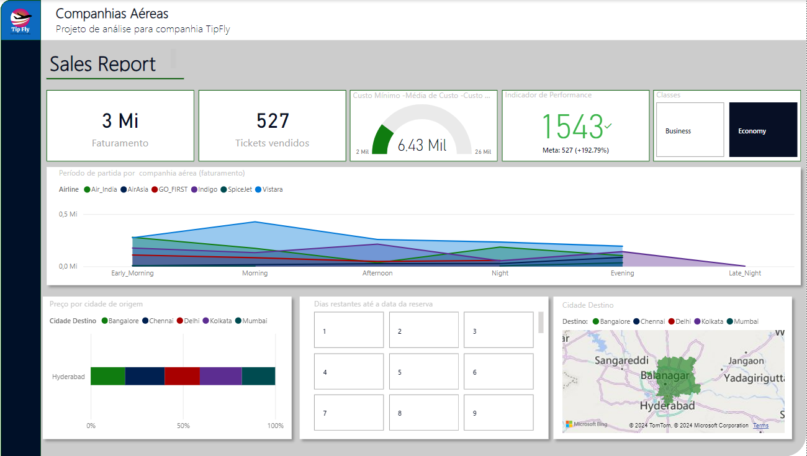

# Análise de vendas de companhias aéreas

## Visão Geral do Projeto
Dei inicio a esse projeto com intuito de aprendizado. Todos os dados foram obtidos pela plataforma da Kaggle. Esse projeto consiste na análise de dados de companhias aérea. Utilizei algumas ferramentas para análise que contribuíram para conseguir informações e insights, tais como KPI (Key Performance Indicator), segmentação de dados, cartões e mapa coroplético, ferramentas essas disponíveis no Power BI. Preocupado com a interface gráfica resolvi dedicar um tempo a mais para torna-la mais amigável. 

## Finalidade 
Esse projeto foi desenvolvido para aprendizado apenas, sinta-se á vontade para modifica-lo. Estou aberto para sugestões e também para novos olhares sob o meio trabalho, pois acredito que precisa melhorar bastante ainda ! 

## Visuais Utilizados
- Cartão : Faturamento, Tickets Vendidos.
- Segmentação de Dados : Classes e Dias Restantes até a data da reserva.
- KPI : Indicador de Performance
- Indicador : Custo Minimo, Média de Custo e Custo Máximo.
- Mapa coroplético : Cidade Destino.
- Gráfico de Área : Período de partida por companhia aérea (faturamento).
- Gráfico de Barras 100% empilhadas : Preço por cidade de origem.

## Perguntas feitas para nortear para a análise

- a) Qual é o período em que as passagens aéreas geralmente têm preços mais elevados em relação aos dias consecutivos?
- b) Como o faturamento das companhias aéreas se comporta após a primeira quinzena?
- c) Quais são as características dos preços das passagens no período de partida da madrugada em comparação com outros horários?
- d) Por que algumas pessoas preferem outras companhias quando o custo das passagens na classe econômica é alto?
- e) Qual é a relação entre o preço das passagens na classe executiva e o número de tickets vendidos?

## Conclusão
É possivel notar que para as companhias aéreas as primeiras quinzenas são os dias em que as passagens estão em um valor mais elevado em consideração aos dias consecutivos; Ápos a quinzena o faturamento tende a cair. Em geral, os preços das passagens no periódo de partida da madrugada são mais baratos em relação aos demais horários e isso não reflete em uma diminuição no faturamento das companhias. O preço da passagem varia entre as companhias e em casos que para classe economica existe um custo alto da passagem o faturamento da empresa é absurdamente reduzido o que se traduz na preferencia por outras companhias. A classe executiva possui um preço maior em relação a economica, e fatura mais para as companhias; No entanto, o número de tickets vendidos é menor. Passagens com locais distante em relação ao destino tendem a serem mais caras.
